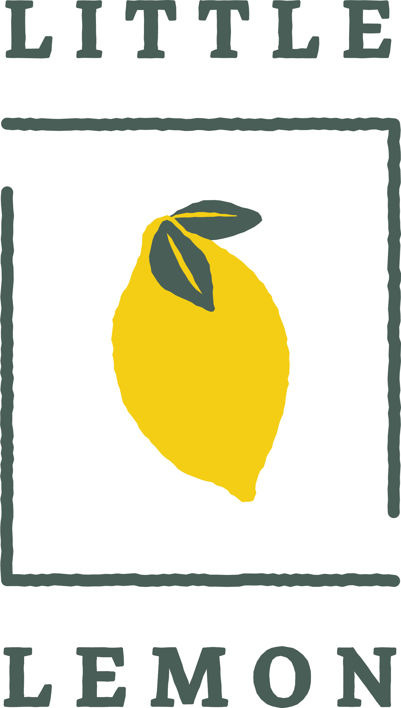
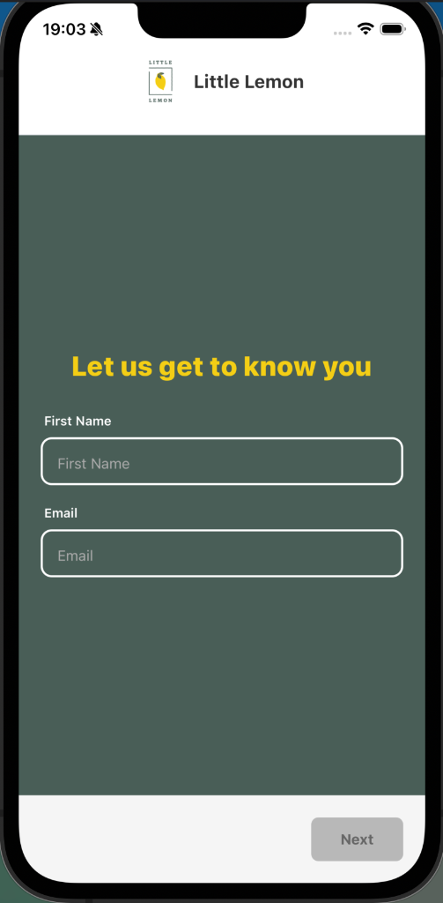
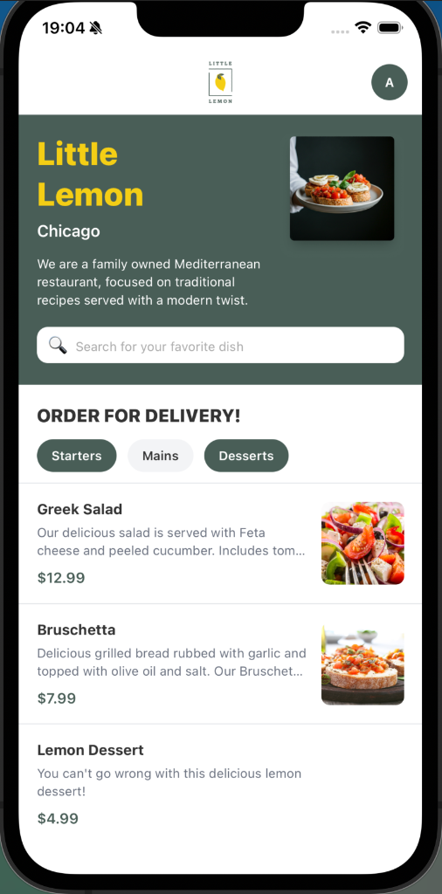
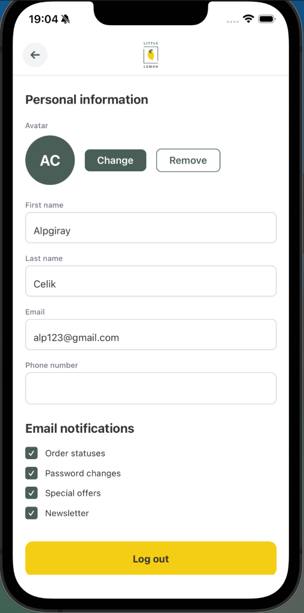

# <p align="center">🍋 Little Lemon • Mobile App</p>

<p align="center">
  
</p>

<p align="center">
  <b>Meta React Native Capstone Project</b>
</p>

<p align="center">
  A premium React Native mobile experience built with <b>Expo</b> and <b>TypeScript</b>. 
  This project represents the practical application of advanced concepts learned throughout the Meta Front-End Developer Professional Certificate.
</p>

<p align="center">
  
  
  
  
</p>

---

## App Showcase

| Onboarding | Home Screen | User Profile |
| :---: | :---: | :---: |
|  |  |  |

---

## Key Features

- **Seamless Onboarding**: Elegant registration flow with real-time field validation.
- **Dynamic Menu Discovery**: Fully categorized menu with multi-select horizontal filtering.
- **Smart Search**: High-performance debounced search for instant dish discovery.
- **SQL Power**: Advanced local data persistence using **SQLite** for lightning-fast offline access.
- **Profile Management**: Comprehensive user preference storage and avatar selection.
- **Notification Control**: Customizable settings for a personalized user experience.
- **Modern Aesthetics**: Fluid, responsive UI styled with **NativeWind v4** (Tailwind CSS).

---

## Tech Stack

| Technology | Purpose |
| :--- | :--- |
| **Expo (v55)** | Industry-standard React Native development framework |
| **NativeWind v4** | Modern utility-first styling system |
| **React Navigation v7** | Advanced stack-based application routing |
| **expo-sqlite** | Robust local database for menu caching |
| **AsyncStorage** | Secure key-value storage for application state |

---

## Project Architecture

```bash
little-lemon-mobile/
├── App.tsx                  # Root navigator & state configuration
├── screens/                 # Primary application views
│   ├── Onboarding.tsx       # Authentication & user setup
│   ├── Home.tsx             # Core menu discovery engine
│   └── Profile.tsx          # Account settings & preferences
├── components/              # Reusable UI architecture
│   ├── Header.tsx           # Branded navigation interface
│   └── SplashScreen.tsx     # Optimized startup experience
└── utils/                   # Business logic & data orchestration
    └── database.ts          # SQLite lifecycle & query management
```

---

## Getting Started

1. **Clone & Install**:
   ```bash
   npm install
   ```

2. **Initialize Expo**:
   ```bash
   npx expo start
   ```

3. **Experience the App**:
   - Use **Expo Go** on your device or run on **iOS/Android** simulators.

---

## Professional Design System

| Token | Category | Color |
| :--- | :--- | :--- |
| **Primary Green** | Brand Identity | `#495E57` |
| **Primary Yellow** | Action / Focus | `#F4CE14` |
| **Secondary Light** | UI Background | `#EDEFEE` |
| **Deep Charcoal** | Typography | `#333333` |

---

<p align="center"><b>Final Capstone Project for Meta Front-End Developer Certificate</b></p>
<p align="center">Made with ❤️ for Little Lemon Chicago</p>
